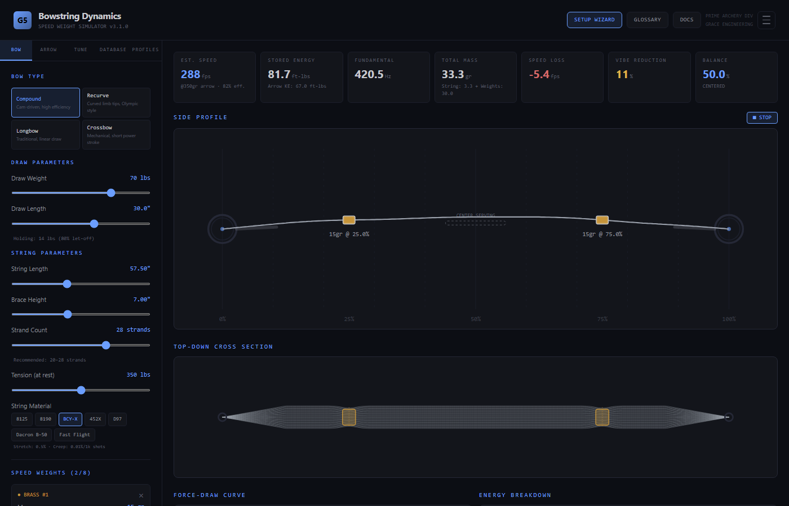
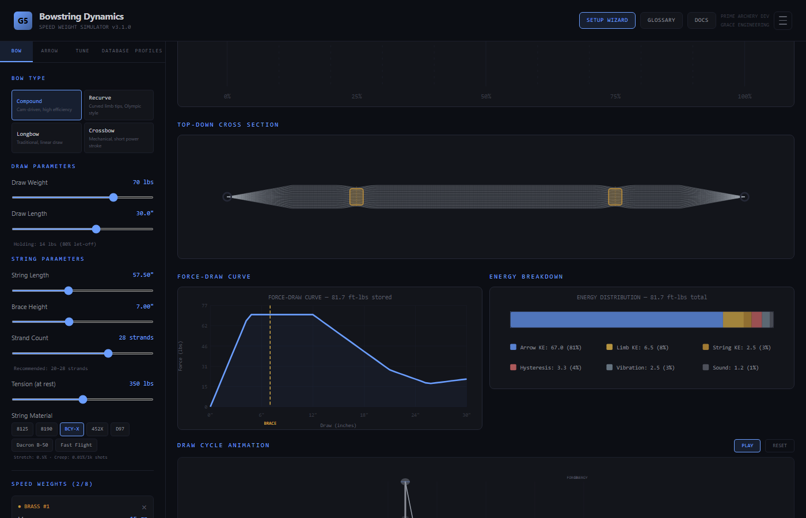
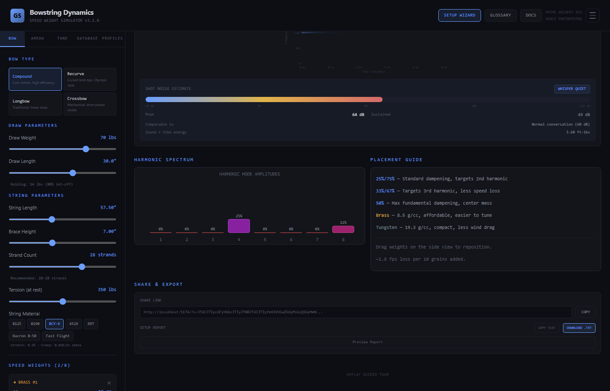
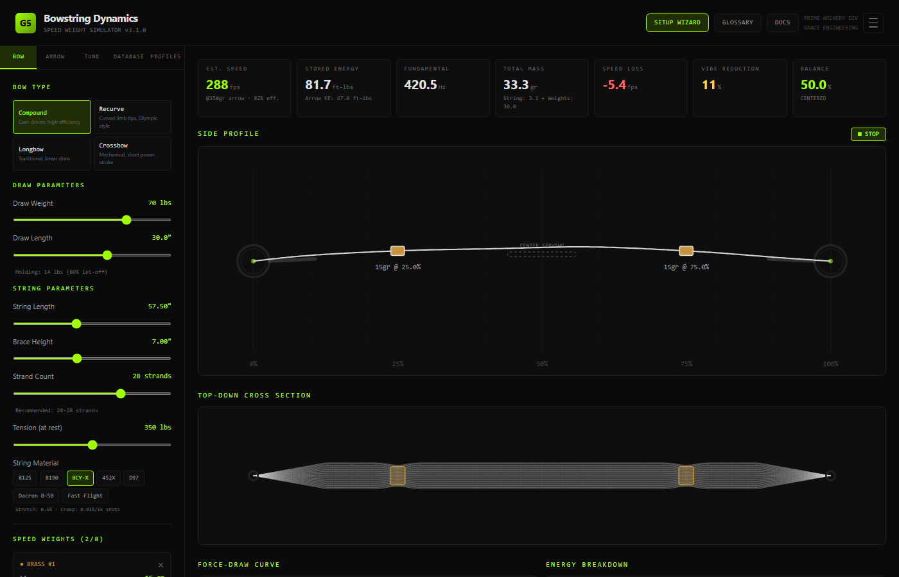

# 🏹 Bowstring Dynamics Simulator

### Real-time archery physics. In your browser. No excuses.

<p align="center">
  
</p>

<p align="center">
  <strong>v3.1.0</strong> &nbsp;·&nbsp; React 19 + TypeScript &nbsp;·&nbsp; Vite &nbsp;·&nbsp; Zustand &nbsp;·&nbsp; Tailwind v4<br/>
  <em>145 tests passing &nbsp;·&nbsp; PWA installable &nbsp;·&nbsp; Works offline</em>
</p>

---

## What Is This?

Bowstring Dynamics is a browser-based physics simulator built for archers, bow techs, and engineers who want to **see** what's actually happening when they change string materials, add speed weights, swap arrow shafts, or adjust nock height.

Every slider you move recalculates the full physics pipeline in real time — string vibration modes, arrow velocity, energy distribution, ballistic trajectory, noise levels — rendered in crisp SVG with zero plugins.

Built by [Grace/Prime Engineering](https://github.com/just-shane) to support our competitive archery R&D workflow.

---

## ⚡ At a Glance

| | |
|---|---|
| 🏗️ **4 Bow Families** | Compound (cam let-off), Recurve, Longbow, Crossbow |
| 🧵 **7 String Materials** | BCY-X, 452X, 8190, D97, Dacron B-50, Fast Flight, 8125 — real specs |
| 🏹 **15 Arrow Shafts** | Full builder: shaft + point + nock + fletching + wrap → FOC & dynamic spine |
| ⚖️ **8 Speed Weights** | Brass & tungsten, drag-to-position, see exact fps tradeoff |
| 📊 **15 Bow Database** | Mathews, Hoyt, Bowtech, PSE, Prime, Elite, Bear, Win&Win + more |
| 🎨 **7 Themes** | Midnight, Neon, Dracula, Nord, Monokai, Catppuccin, High Contrast |

---

## 🔬 The Physics

This isn't a toy calculator. Every number on screen comes from a real model.

### String Vibration
```
fₙ = (n / 2L) × √(T / μ)
```
8 harmonic modes animated in real time. Place weights at antinodes to kill specific frequencies — watch the damping happen live.

### Arrow Velocity
```
v = √(2 × η × E_stored / m_virtual)
where m_virtual = m_arrow + m_string/3
```
Force-draw curves computed via numerical integration. Efficiency factors calibrated per bow type.

### Ballistics
```
F_drag = ½ × Cd × ρ × A × v²
```
Euler-integrated trajectory with quadratic drag, gravity, and wind. KE & momentum tables every 10 yards out to 100.

### Reference Benchmarks
| Metric | Value |
|--------|-------|
| IBO compound speed | ~300 fps (70# / 30" / 350 gr) |
| String mass (24-strand BCY-X) | 70–90 gr |
| Speed penalty | ~1.8 fps per 10 gr added |
| Fundamental frequency | 120–160 Hz |

---

## 📸 Screenshots

### Dashboard — Midnight Theme
Full control panel on the left, animated string visualizer with weight positions, real-time stats bar across the top.

<p align="center">
  
</p>

### Force-Draw Curve & Energy Breakdown
See exactly where every ft-lb goes: arrow KE, limb KE, string KE, hysteresis, vibration, and sound losses.

<p align="center">
  
</p>

### Sound Analysis & Harmonic Spectrum
Vibration decay waterfall, calibrated dB noise estimate, and per-harmonic amplitude bars with weight placement guide.

<p align="center">
  
</p>

### Neon Theme — Same Data, Different Vibe
All 7 themes swap instantly via CSS custom properties. No reload.

<p align="center">
  
</p>

---

## 🧰 Feature Breakdown

### 🎯 Bow & String Lab
- **4 bow types** with distinct force-draw profiles and efficiency curves
- **7 real string materials** — stretch, creep, mass-per-strand all from manufacturer data
- **Strand count & tension** affect fundamental frequency, harmonic spectrum, everything
- **Brace height** modeling — see how it shifts stored energy and arrow speed

### 🏹 Arrow Builder
- **15 real-world shafts** — Easton, Gold Tip, Carbon Express, Victory, Black Eagle
- Dial in point weight, nock weight, fletching, wraps — down to the grain
- Instant **FOC calculation**, **static & dynamic spine**, spine match recommendations
- Wind-adjusted ballistic tables with KE and momentum at every distance

### 🔧 Tuning Tools
- **Paper tune** diagnostic — reads your tear pattern and tells you what's wrong
- **Bare shaft** comparison — see point-of-impact shift vs fletched
- **Walk-back** tune — detects rest alignment issues at distance
- **Setup optimizer** — recommends nock height, rest position, arrow spine

### 📡 Sound & Vibration
- **Vibration decay waterfall** — time-frequency visualization of post-shot ring
- **Calibrated dB estimate** — peak and sustained noise with real-world comparisons
- **Play Twang** — Web Audio synthesis of your exact string's harmonic profile
- **Whisper Quiet badge** — earn it by getting noise below threshold

### 🗄️ Database & Profiles
- **15-bow database** — specs from Mathews, Hoyt, Bowtech, PSE, Prime, Elite, Bear, Win&Win, Gillo, Howard Hill, TenPoint, Ravin
- **6 arrow presets** — Hunting Heavy, Hunting Standard, Hunting Light, Outdoor Target, Indoor Target, 3D
- **Save/load profiles** — snapshot your entire setup to localStorage
- **Share links** — base64-encoded URL shares your full config in one click

### 🧙 Setup Wizard & Tour
- **Guided wizard** — takes your purpose, experience, arm span → recommends draw weight, length, spine, shaft
- **11-step guided tour** — walks new users through every feature
- Version-aware: re-triggers on updates so you discover new stuff

### ♿ Accessibility & PWA
- Full **ARIA roles** — landmark regions, tablist navigation, live regions, skip-nav link
- **High Contrast theme** — pure black + white + bright green for maximum readability
- **PWA installable** — add to home screen, works offline via service worker
- **State persistence** — every slider position auto-saved to localStorage

---

## 🛠️ Tech Stack

| Layer | Tech |
|-------|------|
| ⚛️ UI | React 19 + TypeScript (strict) |
| ⚡ Build | Vite — sub-second HMR, tree-shaken production builds |
| 🧠 State | Zustand — single store, debounced localStorage persistence |
| 🎨 Styling | Tailwind CSS v4 + CSS custom properties for runtime theming |
| 📐 Charts | Pure inline SVG — scales perfectly, razor sharp at any zoom |
| 🧮 Physics | Web Worker with auto-fallback to main thread |
| 📦 Code Split | React.lazy() + Suspense — 9 lazy-loaded components, ~25% smaller initial bundle |
| 🧪 Tests | Vitest — 145 tests across 6 test files |
| 📱 PWA | manifest.json + service worker (network-first caching) |
| 🎓 Tour | react-joyride — theme-matched, version-aware |

---

## 🚀 Quick Start

```bash
git clone https://github.com/just-shane/bowstring-sim.git
cd bowstring-sim
npm install
npm run dev
```

Open [http://localhost:5173](http://localhost:5173) and start tuning.

### Other Commands

```bash
npm run build       # Production build
npm run preview     # Preview production build
npm test            # Run all 145 tests
npm run lint        # TypeScript type checking
```

---

## 📁 Project Structure

```
src/
├── lib/
│   ├── physics.ts          # Core physics engine — bow profiles, force-draw, velocity
│   ├── physics.worker.ts   # Web Worker entry point
│   ├── usePhysicsWorker.ts # React hook — worker with auto-fallback
│   ├── arrow.ts            # Arrow builder — shafts, FOC, spine, ballistics
│   ├── audio.ts            # Sound synthesis, vibration waterfall, draw cycle
│   ├── bows.ts             # Bow database, profiles, presets, share links
│   ├── glossary.ts         # 28 archery terms + wizard recommendation engine
│   ├── themes.ts           # 7 themes with full color token system
│   ├── persist.ts          # localStorage state persistence
│   └── version.ts          # Single source of truth for version
├── components/
│   ├── StringVisualizer/   # Animated SVG string with harmonic modes
│   ├── ControlPanel/       # Sliders, bow type picker, material selector
│   ├── StatsBar/           # Real-time speed, energy, mass, frequency readout
│   ├── DrawCycle/          # Animated draw sequence visualization
│   ├── SoundAnalysis/      # Waterfall, dB meter, Play Twang
│   ├── BowDatabase/        # Searchable bow specs + arrow presets
│   ├── Profiles/           # Save/load/delete user profiles
│   ├── ShareExport/        # Share links + text report export
│   ├── Glossary/           # Modal glossary with search
│   ├── Wizard/             # Multi-step setup wizard
│   ├── Tour/               # Guided tour (react-joyride)
│   ├── Tuning/             # Paper tune, bare shaft, walk-back, optimizer
│   └── Layout/             # Header, hamburger menu
├── store.ts                # Zustand store — params, weights, arrow, tuning
└── App.tsx                 # Root — lazy loading, tabs, layout, ARIA
```

---

## 🤝 Contributing

1. Fork the repo
2. Create a feature branch (`git checkout -b feature/my-thing`)
3. Write tests for new physics or UI features
4. Make sure all 145+ tests pass (`npm test`)
5. Open a PR with a clear description

---

## 📄 License

MIT — do what you want, just don't claim you invented bowstring physics.

---

<p align="center">
  <strong>Built with 🏹 by Grace/Prime Engineering</strong><br/>
  <em>Because if you can't measure it, you can't tune it.</em>
</p>
